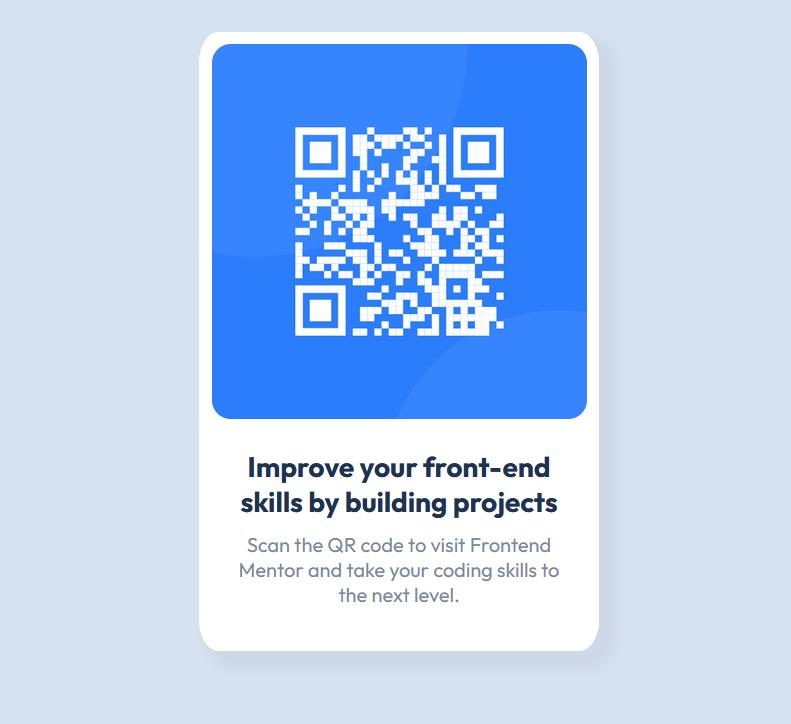

# Frontend Mentor - QR code component solution

This is a solution to the [QR code component challenge on Frontend Mentor](https://www.frontendmentor.io/challenges/qr-code-component-iux_sIO_H). Frontend Mentor challenges help you improve your coding skills by building realistic projects. 

## Overview

### Screenshot

### Links
- Solution URL: [FM-qr-code-component](../1-qr-code-component/)
- Live Site URL: [QR Code Component](https://jmb-oddbook.github.io/FM-qr-code-component)

## My process
On the design previews I roughed in how I would segment the contents of the page into divs, headers, and other text elements. Then I continued building from the outside in, or from general to specific.

### What I learned
There are many more options to style then there were a few years ago :wink:

### Continued development
I need to look into when to use which units for font-size as well as when to use the viewport size as a unit.
